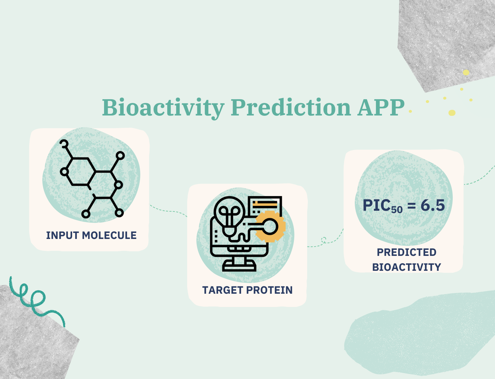

## 🔄 Relationship to Drug-Discovery Project

This application represents the practical implementation and deployment phase of the [Drug-Discovery](https://github.com/zeineb-eya/Drug-Discovery) project:

- **Research Phase**: The Drug-Discovery repository contains Jupyter notebooks that document the entire machine learning workflow for computational drug discovery:
  - Data retrieval from ChEMBL
  - Exploratory data analysis
  - Molecular descriptor calculation
  - Machine learning model development
  - Model evaluation and comparison

- **Implementation Phase**: This Bioactivity Prediction App takes the best-performing model from the research phase and deploys it as a user-friendly web application to enable:
  - Easy access to predictions without requiring programming knowledge
  - Real-time bioactivity predictions using SMILES input
  - Visualization and download of results

If you're interested in understanding the research and development process behind this application, the [Drug-Discovery](https://github.com/zeineb-eya/Drug-Discovery) repository provides comprehensive documentation of all steps taken to develop the predictive model.# Bioactivity Prediction App for Acetylcholinesterase Inhibition

<div align="center">



*Predicting compound bioactivity against Acetylcholinesterase for Alzheimer's disease drug discovery*

[](https://www.python.org/downloads/)
[](https://streamlit.io/)

</div>

## 📋 Table of Contents
- [Overview](#overview)
- [Relationship to Drug-Discovery Project](#relationship-to-drug-discovery-project)
- [Features](#features)
- [Demo](#demo)
- [How It Works](#how-it-works)
- [Installation](#installation)
- [Usage](#usage)
- [Input File Format](#input-file-format)
- [Project Structure](#project-structure)
- [Model Information](#model-information)
- [Dependencies](#dependencies)
- [Troubleshooting](#troubleshooting)
- [Development Roadmap](#development-roadmap)
- [Contributing](#contributing)
- [License](#license)
- [Citation](#citation)
- [Acknowledgements](#acknowledgements)
- [Contact](#contact)

## 🔍 Overview

This web application is a follow-up to the [Drug-Discovery repository](https://github.com/zeineb-eya/Drug-Discovery), which explored machine learning workflows for computational drug discovery. It puts research into practice by implementing a predictive model for Acetylcholinesterase inhibition as a user-friendly web application.

The app predicts the bioactivity of chemical compounds against Acetylcholinesterase, an enzyme that serves as a key drug target for Alzheimer's disease treatment. Users can submit SMILES notations of compounds and receive predictions of their potential activity against this target.

## ✨ Features

- **Chemical Structure Input**: Upload SMILES notations with corresponding molecule names
- **Real-time Predictions**: Get bioactivity predictions with minimal waiting time
- **Molecular Descriptor Calculation**: Automatically calculates PubChem fingerprints using PaDEL
- **Interactive Results**: Visualize and explore prediction outputs
- **Downloadable Reports**: Export predictions as CSV files for further analysis
- **Responsive Design**: Optimized for both desktop and mobile devices

## 🎬 Demo


You can try the live demo at: [https://bioactivity-prediction-app.streamlit.app/](https://bioactivity-predictions.streamlit.app)

## ⚙️ How It Works

1. **Upload Data**: Submit a text file containing SMILES strings paired with molecule names
2. **Process Structures**: The app calculates molecular descriptors using PaDEL-Descriptor
3. **Feature Selection**: Only relevant descriptors are selected based on the pre-trained model
4. **Make Predictions**: A machine learning model predicts bioactivity (pIC50 values)
5. **View Results**: Review predictions and download as CSV for further analysis

## 📥 Installation

### Prerequisites

- Python 3.7 or higher
- Java Runtime Environment (JRE) 8 or higher (for PaDEL-Descriptor)
- Git (optional, for cloning the repository)
- System packages listed in `packages.txt` (if any)

### Setup

```bash
# Clone the repository
git clone https://github.com/zeineb-eya/bioactivity-prediction-app.git
cd bioactivity-prediction-app

# Create and activate a virtual environment
python -m venv .venv

# On Windows
.venv\Scripts\activate

# On macOS/Linux
source .venv/bin/activate

# Install required dependencies
pip install -r requirements.txt

# Run the app
streamlit run app.py
```

### Development Container (Alternative)

The project includes a `.devcontainer` configuration, which allows for development within a containerized environment using Visual Studio Code's Remote - Containers extension.

1. Install [Docker](https://www.docker.com/products/docker-desktop) and [Visual Studio Code](https://code.visualstudio.com/)
2. Install the [Remote - Containers extension](https://marketplace.visualstudio.com/items?itemName=ms-vscode-remote.remote-containers)
3. Open the project folder in VS Code
4. Click on the green icon in the bottom-left corner and select "Reopen in Container"

The container will set up all necessary dependencies automatically.

## 🚀 Usage

1. Launch the app by running `streamlit run app.py`
2. Click the "Browse files" button in the sidebar to upload your input file
3. The input file should be a text file (.txt) with each line containing:
   - A SMILES string followed by a space and molecule name (e.g., CHEMBL ID)
4. Click the "Predict" button to generate bioactivity predictions
5. View the original input data, calculated descriptors, and prediction results
6. Download the predictions as a CSV file by clicking "Download Predictions"

## 📝 Input File Format

Your input file should be a text file (.txt) with each line following this format:
```
[SMILES] [Molecule_Name]
```

Example from `data/example_acetylcholinesterase.txt`:
```
O=C(Oc1ccccc1C(=O)O)C CHEMBL25
CC(=O)Oc1ccccc1C(=O)O CHEMBL605
CCN(CC)CCOC(=O)C(C)(C)C CHEMBL1201330
```

> **Note:** The app comes with an example input file in the `data` folder that you can use to test the functionality.

## 📂 Project Structure

```
bioactivity-prediction-app/
├── .devcontainer/                  # Development container configuration
├── .streamlit/                     # Streamlit configuration
│   └── config.toml                 # Streamlit configuration file
├── .venv/                          # Virtual environment (not tracked in git)
├── assets/                         # Images and static files
│   ├── logo.png                    # App logo
│   ├── machine-learning.png        # ML illustration
│   └── molecule.png                # Molecule illustration
├── data/                           # Model and data files
│   ├── acetylcholinesterase_06_bioactivity_data_3class_pIC50_pubchem_fp.csv
│   ├── descriptor_list.csv         # Features used in the model
│   ├── descriptors_output.csv      # Calculated descriptors
│   ├── example_acetylcholinesterase.txt  # Example input file
│   └── prediction.csv              # Sample prediction output
├── PaDEL-Descriptor/               # Descriptor calculation tool
├── .gitattributes                  # Git attributes configuration
├── .gitignore                      # Git ignore file
├── acetylcholinesterase_model.pkl  # Trained ML model
├── app.py                          # Main Streamlit application
├── bioactivity_prediction_app.ipynb # Jupyter notebook for development
├── packages.txt                    # System packages required
└── requirements.txt                # Python dependencies
```

## 🧠 Model Information

The prediction model was developed as part of the [Drug-Discovery](https://github.com/zeineb-eya/Drug-Discovery) project and was trained using a curated dataset of known Acetylcholinesterase inhibitors with experimentally determined pIC50 values from ChEMBL. The model employs:

- **Descriptors**: PubChem fingerprints (881 binary features)
- **Algorithm**: Random Forest Regression
- **Performance**: R² = 0.82, RMSE = 0.64 log units (5-fold cross-validation)
- **Applicability Domain**: Small molecules with drug-like properties

This web application represents the practical implementation and deployment of research conducted in the original Drug-Discovery project.

## 📚 Dependencies

Primary dependencies include:
- `streamlit` - Web application framework
- `pandas` - Data manipulation
- `scikit-learn` - Machine learning functionality
- `pillow` - Image processing for handling images
- `numpy` - Numerical computations

The project requires a Java Runtime Environment for PaDEL-Descriptor to function properly.

For a complete list of Python dependencies, refer to `requirements.txt`.
For any system packages required, refer to `packages.txt`.

## ❓ Troubleshooting

- **Java Error**: Ensure Java is installed and properly configured
  ```bash
  java -version  # Should return Java version information
  ```
- **File Upload Issues**: Verify your file follows the correct format with SMILES and molecule name separated by a space
- **Missing Descriptors**: If descriptor calculation fails, check your SMILES strings for valid chemical notation
- **Performance Issues**: For large datasets, consider using smaller batches of molecules

## 🛣️ Development Roadmap

Future enhancements planned:
- [ ] Add support for multiple bioactivity targets
- [ ] Implement batch processing for large datasets
- [ ] Incorporate molecular visualization
- [ ] Add confidence intervals for predictions
- [ ] Develop REST API for programmatic access

## 🙏 Acknowledgements

- This app is the implementation phase of research conducted in the [Drug-Discovery](https://github.com/zeineb-eya/Drug-Discovery) project
- Descriptor calculation using [PaDEL-Descriptor](http://www.yapcwsoft.com/dd/padeldescriptor/) [[Paper]](https://doi.org/10.1002/jcc.21707)
- Built with [Streamlit](https://streamlit.io/)
- Molecular data from [ChEMBL](https://www.ebi.ac.uk/chembl/)
- Inspired by techniques from [Chanin Nantasenamat's](https://github.com/dataprofessor) work on bioactivity prediction

## 📬 Contact

Zeineb Eya Rahmani

[](mailto:zeineb.eya.rahmani@outlook.com)
[](https://github.com/zeineb-eya/)

---

<div align="center">
  <sub>Built with ❤️ by Zeineb Eya Rahmani</sub>
</div>
